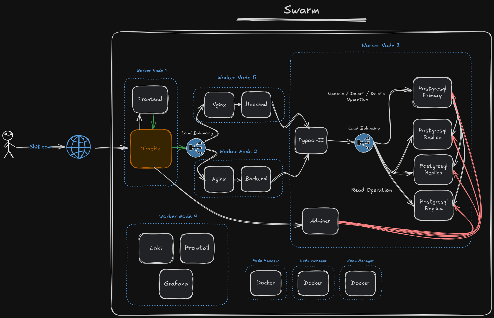

# Infra-as-code sample project
Nothing to say right now.

## Table of Contents

- [Architecture Overview](#architecture-overview)
- [Contributing](#contributing)
- [License](#license)

## Architecture Overview

## Contributing

Contributions are welcome! To contribute:

1. Fork the repository.
2. Create a new branch (`git checkout -b feature/your-feature`).
3. Make your changes and commit (`git commit -m "Add your feature"`).
4. Push to the branch (`git push origin feature/your-feature`).
5. Open a pull request.

Please ensure your changes are well-documented and tested.

## License

This project is licensed under the MIT License. See the [LICENSE](LICENSE) file for details.